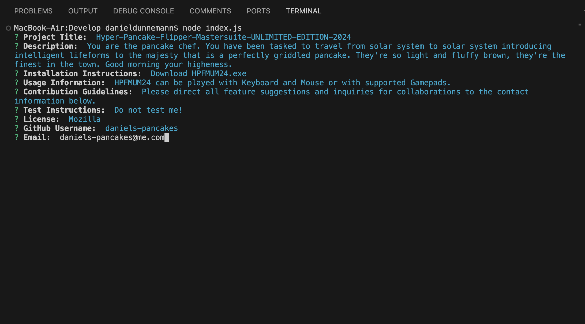

# README Generator

## Description
With this JavaScript you can create a simple README file to deploy along with your projects and applications. When the index.js is ran with node in command line, the script will prompt the user to enter information about their project. This information will then be used to populate a README file.

## Table of Contents
* [Installation Instructions](#installation-instructions)
* [Usage Information](#usage-information)
* [Contribution Guidelines](#contribution-guidelines)
* [Test Instructions](#test-instructions)
* [Questions](#questions)

## Installation Instructions
Ensure that node is installed. The corresponding packages and dependencies. are present in the development folder of this project. 

## Usage Information
To use, simply navigate to directory where you have installed the files in command line and run 'node index.js' from command line. The script will prompt the user through the process.

### Preview

## Contribution Guidelines
There are no plans to open this project to outside contributors at this time.

## Test Instructions
No tests implemented at this time.

## Questions
Please reach out to me for additional inquiries:
https://github.com/daniels-pancakes
ddunnemann@gmail.com